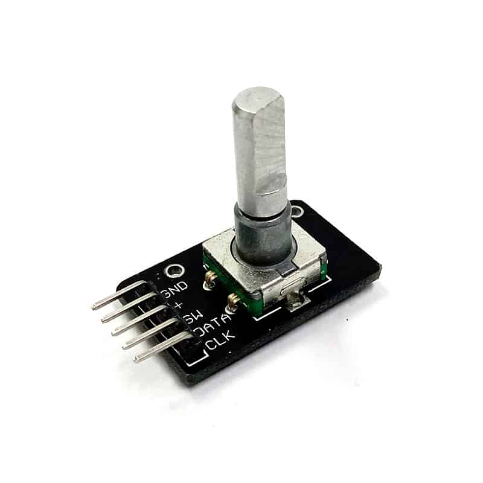

# KY040 Library Code

KY040 is a header-only Platform IO library with Arduino framework that interfaces with the rotary encoder and switch module, KY040, as illustrated as Figure 1 below.

 \
_Figure 1: KY040 module_

It is tested on Raspberry Pi Pico with the sample code under the `test/` directory. Below is a sample usage for this library.

```cpp
#include <Arduino.h>
#include <ky040.hpp>

constexpr const PinName clk_pin = PinName::p13;
constexpr const PinName dt_pin = PinName::p12;
constexpr const PinName sw_pin = PinName::p11;
KY040<clk_pin, dt_pin, sw_pin> input_device;

void setup()
{
    delay(2000);
    Serial.begin(9600);
    input_device.begin();
    while (!Serial)
    {
    }
}

void loop()
{
    int8_t step = input_device.process();
    if(step > 0) {
        // Rotated clockwise.
    } else if (step < 0) {
        // Rotated anticlockwise.
    } else {
        // Did not rotate.
    }

    const int16_t rotation = input_device.get_rotation();
    const bool pressed = input_device.is_pressed();

    Serial.print("Rotation: ");
    Serial.print(rotation);
    Serial.print("; Pressed: ");
    Serial.print(pressed ? "true" : "false");
    Serial.print("\n");
}
```

## Installation

In your `platform.io` library, append the URL of this github repository to the `lib_deps` attribute.

```ini
lib_deps=https://github.com/rumelab/ky040_library_code
```
